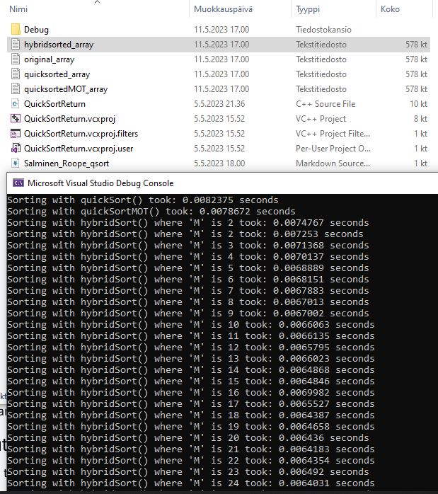
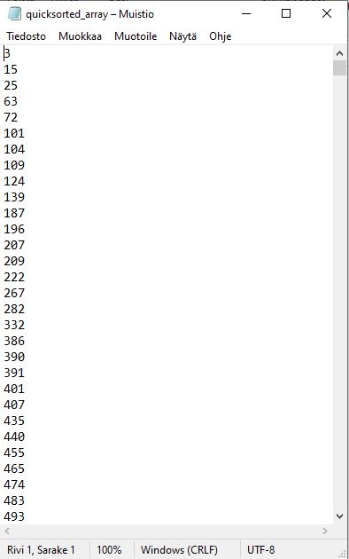
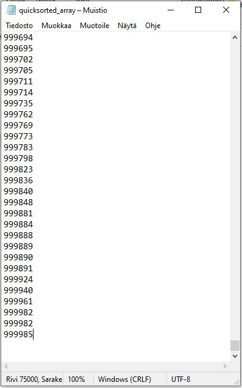
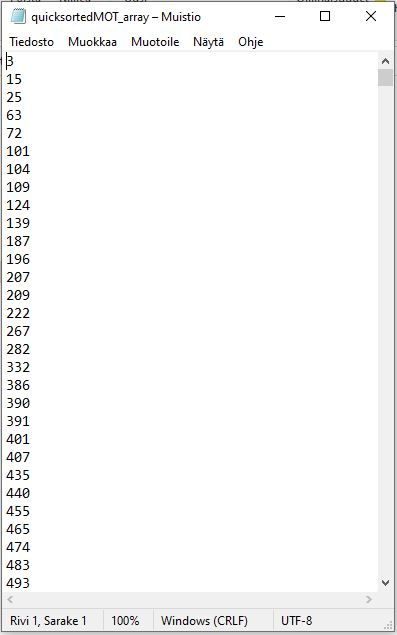
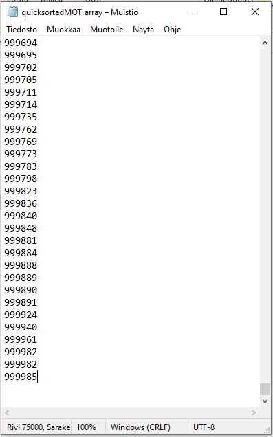
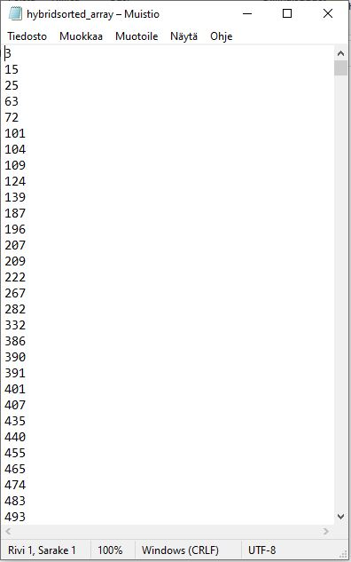
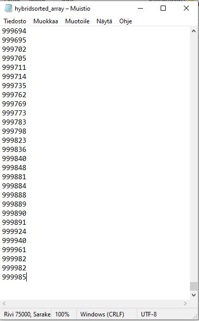
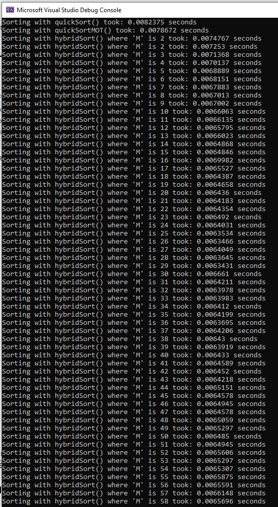
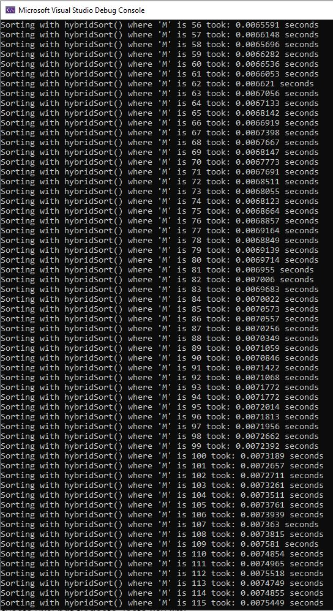
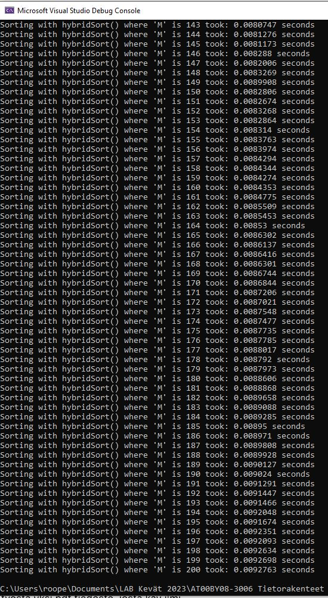

# Final exercise for Tietorakenteet ja algoritmit - Roope Salminen

The task was to create a recursive quick sort -algorithm in three variations, each more complex and hopefully faster than the previous. For testing purposes an array containing 75 000 integers in the range 0 - 1 000 000 was to be generated inside the program.

## Grade and features

As far as I can tell, I implemented all the requested features and thus I am aiming for grade 5.

## General setup for testing

I chose to do the comparisons between the algorithms on the same data and run the tests within a single run of the program. For finding the best cutoff value M for the level 5 hybrid sorting a separate array was generated and copied and sorted 199 times with increasing M value starting from 2 increasing up to 200.

The time to sort was measured with `omp_get_wtime()` and I am not that familiar with its inner workings, but it seemed to produce the best results compared to different methods.

Using `rand()` and the modulo operator for creating an array of data to sort resulted in a very uneven distribution of integers in the array. Most numbers were of the magnitude of 40 000 at the most. Because of this, I looked for a way to produce a more even distribution of numbers and ended up using the following function:

```
int* createIntArray() {
    int* array = new int[75000];
    random_device rd;
    mt19937_64 gen(rd());
    uniform_int_distribution<> dis(0, 1000000);
    for (int i = 0; i < 75000; i++) {
        array[i] = dis(gen);
    }
    return array;
}
```

All the swapping was eventually done as inline because the calls to a separate swap()-function made the quick sort that used the median of three method slower than the basic quick sort.

Below is a screenshot that shows the differences between time to sort between the algorithms on a particular run and the outputted sorted files and the original unsorted array.



The first three lines output results on the same data. In testing there were some cases where the basic quick sort ended up being the fastest of the three, but most of the times the more complex variations were faster, as was the case here too.


## Level 1

Here is the basic `quickSort()` function:

```
void quickSort(int a[], int left, int right) {
    int start;
    int end;
    int pivot;
    int temp;
    if (right > left) {

        // If not using Median of three, pivot
        // is always the rightmost element, start
        // is left - 1 and end is the rightmost index
        pivot = a[right];
        start = left - 1;
        end = right;

        for (;;) {
            while (start < end && a[++start] < pivot) {
                if (start == right) { break; }
            }
            while (a[--end] > pivot) {
                if (end == left) { break; }
            }
            if (start >= end) { break; }
            temp = a[start];
            a[start] = a[end];
            a[end] = temp;
        }

        // For use without median of three
        temp = a[start];
        a[start] = a[right];
        a[right] = temp;

        quickSort(a, left, start - 1);
        quickSort(a, start + 1, right);
    }
}
```

Below are screenshots of the sorted array:




The time to sort was 0.0082375 seconds.

## Level 3

Here is the version that uses the median of three method for choosing the pivot:

```
void quickSortMOT(int a[], int left, int right) {
    int start;
    int end;
    int pivot;
    int temp;
    if (right - left <= 0) { return; }
    // Median of three below:
    // 1) Order the first, middle and last
    // elements correctly. Inline swapping seems
    // faster than calling separate swap()
    int middle = (left + right) / 2;
    if (a[left] > a[middle]) {
        temp = a[left];
        a[left] = a[middle];
        a[middle] = temp;
    }
    if (a[left] > a[right]) {
        temp = a[left];
        a[left] = a[right];
        a[right] = temp;
    }
    if (a[middle] > a[right]) {
        temp = a[middle];
        a[middle] = a[right];
        a[right] = temp;
    }

    // 2) Swap middle element with next-to-last
    temp = a[middle];
    a[middle] = a[right - 1];
    a[right - 1] = temp;

    // 3) Set start and end indexes correctly
    // (due to Median of three: first element is
    // already smaller than pivot and last is greater) and 
    // pivot to be the next-to-last element
    pivot = a[right - 1];
    start = left;
    end = right - 1;

    for (;;) {
        while (start < end && a[++start] < pivot) {
            if (start == right) { break; }
        }
        while (a[--end] > pivot) {
            if (end == left) { break; }
        }
        if (start >= end) { break; }
        temp = a[start];
        a[start] = a[end];
        a[end] = temp;
    }

    // For median of three
    temp = a[start];
    a[start] = a[right - 1];
    a[right - 1] = temp;

    quickSortMOT(a, left, start - 1);
    quickSortMOT(a, start + 1, right);
}
```

Below are screenshots of the sorted array:




The time to sort was 0.0078672 seconds.

## Level 5

Here is the insertion sort that is used after the cutoff value M:

```
void insertionSort(int a[], int left, int right) {
    int i;
    int j;
    int key;
    for (i = left + 1; i <= right; i++) {
        key = a[i];
        j = i - 1;
        while (j >= 0 && a[j] > key) {
            a[j + 1] = a[j];
            j--;
        }
        a[j + 1] = key;
    }
}
```

I made a separate quick sort with median of three for the hybrid sort. It takes an extra parameter int M which is the cutoff value for switching to `insertionSort()`. Other than that, it is identical to the other version with median of three.

```
void quickSortMOTforHybridSort(int a[], int left, int right, int M) {
    int start;
    int end;
    int pivot;
    int temp;
    if (right - left <= M) { return; }
        // Median of three below:
        // 1) Order the first, middle and last
        // elements correctly. Inline swapping seems
        // faster than calling separate swap()
        int middle = (left + right) / 2;
        if (a[left] > a[middle]) {
            temp = a[left];
            a[left] = a[middle];
            a[middle] = temp;
        }
        if (a[left] > a[right]) {
            temp = a[left];
            a[left] = a[right];
            a[right] = temp;
        }
        if (a[middle] > a[right]) {
            temp = a[middle];
            a[middle] = a[right];
            a[right] = temp;
        }

        // 2) Swap middle element with next-to-last
        temp = a[middle];
        a[middle] = a[right - 1];
        a[right - 1] = temp;

        // 3) Set start and end indexes correctly
        // (due to Median of three: first element is
        // already smaller than pivot and last is greater) and 
        // pivot to be the next-to-last element
        pivot = a[right - 1];
        start = left;
        end = right - 1;

        for (;;) {
            while (start < end && a[++start] < pivot) {
                if (start == right) { break; }
            }
            while (a[--end] > pivot) {
                if (end == left) { break; }
            }
            if (start >= end) { break; }
            temp = a[start];
            a[start] = a[end];
            a[end] = temp;
        }

        // For median of three
        temp = a[start];
        a[start] = a[right - 1];
        a[right - 1] = temp;

        quickSortMOTforHybridSort(a, left, start - 1, M);
        quickSortMOTforHybridSort(a, start + 1, right, M);
}
```

And here is the hybrid sort function that calls `quickSortMOTforHybridSort()` first and then `insertionSort()`:

```
void hybridSort(int a[], int left, int right, int M) {
    quickSortMOTforHybridSort(a, left, right, M);
    insertionSort(a, left, right);
}
```

Below are screenshots of the sorted array when M = 2:




The time to sort was 0.0074767 seconds.

### Finding the best M value

I tested values from 2 to 200 on the same data and it is very difficult to name a single best value that would produce the best results every time. This time the value M = 29 seems best with time to sort being 0.0063431. In general the best times with this type of data seem to fall in the range where M is from about 20 to 40. At least we can see that when M reaches 100 and above, the slowness of insertion sort with larger sets seems apparent as the time to sort is clearly longer than with smaller values of M.





## The whole code

```
#include <iostream>
#include <random>
#include <omp.h>
#include <fstream>

using namespace std;

// This program has the following sorting algorithms:
//
// insertionSort(): Basic insertionSort algorithm used in
// hybridSort() together with quickSortMOTforHybridSort()
// 
// quickSort(): Basic quickSort algorithm
// 
// quickSortMOT(): quickSort that uses the Median of Three 
// -method for choosing the pivot element
// 
// quickSortMOTforHybridSort(): same as above except there 
// is a cutoff value M for returning early. This is a separate 
// function from the above for practical purposes.
// This way the three functions (algorithms): quickSort, 
// quickSort with Median of Three and hybridSort with 
// a cutoff for changing from quickSort with Median of three 
// to insertionSort can be compared with a single
// run of the program, and they all sort the same array.
// 
// hybridSort(): calls quickSortMOTforHybridSort() first 
// and then insertionSort()


// createIntArray() creates an array containing 75000 elements between 0-1000000.
// It makes the distribution more even than using rand() and modulo -operator.


// To create  a more uniformly distributed array
// than by using rand() and modulo:
int* createIntArray() {
    int* array = new int[75000];
    random_device rd;
    mt19937_64 gen(rd());
    uniform_int_distribution<> dis(0, 1000000);
    for (int i = 0; i < 75000; i++) {
        array[i] = dis(gen);
    }
    return array;
}


void insertionSort(int a[], int left, int right) {
    int i;
    int j;
    int key;
    for (i = left + 1; i <= right; i++) {
        key = a[i];
        j = i - 1;
        while (j >= 0 && a[j] > key) {
            a[j + 1] = a[j];
            j--;
        }
        a[j + 1] = key;
    }
}


void quickSort(int a[], int left, int right) {
    int start;
    int end;
    int pivot;
    int temp;
    if (right > left) {

        // If not using Median of three, pivot
        // is always the rightmost element, start
        // is left - 1 and end is the rightmost index
        pivot = a[right];
        start = left - 1;
        end = right;

        for (;;) {
            while (start < end && a[++start] < pivot) {
                if (start == right) { break; }
            }
            while (a[--end] > pivot) {
                if (end == left) { break; }
            }
            if (start >= end) { break; }
            temp = a[start];
            a[start] = a[end];
            a[end] = temp;
        }

        // For use without median of three
        temp = a[start];
        a[start] = a[right];
        a[right] = temp;

        quickSort(a, left, start - 1);
        quickSort(a, start + 1, right);
    }
}


void quickSortMOT(int a[], int left, int right) {
    int start;
    int end;
    int pivot;
    int temp;
    if (right - left <= 0) { return; }
    // Median of three below:
    // 1) Order the first, middle and last
    // elements correctly. Inline swapping seems
    // faster than calling separate swap()
    int middle = (left + right) / 2;
    if (a[left] > a[middle]) {
        temp = a[left];
        a[left] = a[middle];
        a[middle] = temp;
    }
    if (a[left] > a[right]) {
        temp = a[left];
        a[left] = a[right];
        a[right] = temp;
    }
    if (a[middle] > a[right]) {
        temp = a[middle];
        a[middle] = a[right];
        a[right] = temp;
    }

    // 2) Swap middle element with next-to-last
    temp = a[middle];
    a[middle] = a[right - 1];
    a[right - 1] = temp;

    // 3) Set start and end indexes correctly
    // (due to Median of three: first element is
    // already smaller than pivot and last is greater) and 
    // pivot to be the next-to-last element
    pivot = a[right - 1];
    start = left;
    end = right - 1;

    for (;;) {
        while (start < end && a[++start] < pivot) {
            if (start == right) { break; }
        }
        while (a[--end] > pivot) {
            if (end == left) { break; }
        }
        if (start >= end) { break; }
        temp = a[start];
        a[start] = a[end];
        a[end] = temp;
    }

    // For median of three
    temp = a[start];
    a[start] = a[right - 1];
    a[right - 1] = temp;

    quickSortMOT(a, left, start - 1);
    quickSortMOT(a, start + 1, right);
}


void quickSortMOTforHybridSort(int a[], int left, int right, int M) {
    int start;
    int end;
    int pivot;
    int temp;
    if (right - left <= M) { return; }
        // Median of three below:
        // 1) Order the first, middle and last
        // elements correctly. Inline swapping seems
        // faster than calling separate swap()
        int middle = (left + right) / 2;
        if (a[left] > a[middle]) {
            temp = a[left];
            a[left] = a[middle];
            a[middle] = temp;
        }
        if (a[left] > a[right]) {
            temp = a[left];
            a[left] = a[right];
            a[right] = temp;
        }
        if (a[middle] > a[right]) {
            temp = a[middle];
            a[middle] = a[right];
            a[right] = temp;
        }

        // 2) Swap middle element with next-to-last
        temp = a[middle];
        a[middle] = a[right - 1];
        a[right - 1] = temp;

        // 3) Set start and end indexes correctly
        // (due to Median of three: first element is
        // already smaller than pivot and last is greater) and 
        // pivot to be the next-to-last element
        pivot = a[right - 1];
        start = left;
        end = right - 1;

        for (;;) {
            while (start < end && a[++start] < pivot) {
                if (start == right) { break; }
            }
            while (a[--end] > pivot) {
                if (end == left) { break; }
            }
            if (start >= end) { break; }
            temp = a[start];
            a[start] = a[end];
            a[end] = temp;
        }

        // For median of three
        temp = a[start];
        a[start] = a[right - 1];
        a[right - 1] = temp;

        quickSortMOTforHybridSort(a, left, start - 1, M);
        quickSortMOTforHybridSort(a, start + 1, right, M);
}

void hybridSort(int a[], int left, int right, int M) {
    quickSortMOTforHybridSort(a, left, right, M);
    insertionSort(a, left, right);
}

int main()
{
    // doubles for measuring sorting time
    double begin;
    double stop;


    // create an array and two copies for
    // comparing time to sort between different algorithms
    int* a1 = createIntArray();
    int* a2 = new int[75000];
    int* a3 = new int[75000];

    for (int i = 0; i < 75000; i++) {
        a2[i] = a1[i];
        a3[i] = a1[i];
    }

    // output original unsorted array for debugging
    // and sorting in Excel for example
    ofstream originalArray("original_array.txt");
    if (originalArray.is_open()) {
        for (int i = 0; i < 75000; i++) {
            originalArray << a1[i] << endl;
        }
        originalArray.close();
    }
    else {
        cout << "Couldn't open file." << endl;
    }


    // measure time to sort using quickSort()
    // and output sorted array to file
    begin = omp_get_wtime();
    quickSort(a1, 0, 74999);
    stop = omp_get_wtime();
    cout << "Sorting with quickSort() took: " << stop - begin << " seconds" << endl;

    ofstream quickSortFile("quicksorted_array.txt");
    if (quickSortFile.is_open()) {
        for (int i = 0; i < 75000; i++) {
            quickSortFile << a1[i] << endl;
        }
        quickSortFile.close();
    }
    else {
        cout << "Couldn't open file." << endl;
    }


    // measure time to sort using quickSortMOT()
    // and output sorted array to file
    begin = omp_get_wtime();
    quickSortMOT(a2, 0, 74999);
    stop = omp_get_wtime();
    cout << "Sorting with quickSortMOT() took: " << stop - begin << " seconds" << endl;

    ofstream quickSortMOTFile("quicksortedMOT_array.txt");
    if (quickSortMOTFile.is_open()) {
        for (int i = 0; i < 75000; i++) {
            quickSortMOTFile << a2[i] << endl;
        }
        quickSortMOTFile.close();
    }
    else {
        cout << "Couldn't open file." << endl;
    }


    // measure time to sort using hybridSort()
    // and output sorted array to file
    begin = omp_get_wtime();
    hybridSort(a3, 0, 74999, 2);
    stop = omp_get_wtime();
    cout << "Sorting with hybridSort() where 'M' is 2" << " took: " << stop - begin << " seconds" << endl;

    ofstream hybridSortFile("hybridsorted_array.txt");
    if (hybridSortFile.is_open()) {
        for (int i = 0; i < 75000; i++) {
            hybridSortFile << a3[i] << endl;
        }
        hybridSortFile.close();
    }
    else {
        cout << "Couldn't open file." << endl;
    }
    
    // create a new array for testing different values of M
    // in order to try and determine fastest value
    int* arr = createIntArray();
    int M_max = 200;

    // make a copy of 'arr' for each value of M from 2 to M_max
    // and sort it and measure time to sort
    for (int M = 2; M <= M_max; M++) {
        int* arr_copy = new int[75000];
        copy(arr, arr + 75000, arr_copy);

        begin = omp_get_wtime();
        hybridSort(arr_copy, 0, 74999, M);
        stop = omp_get_wtime();
       
        cout << "Sorting with hybridSort() where 'M' is " << M << " took: " << stop - begin << " seconds" << endl;

        delete[] arr_copy;
    }

    delete[] arr;
    delete[] a1;
    delete[] a2;
    delete[] a3;
    return 0;
}
```